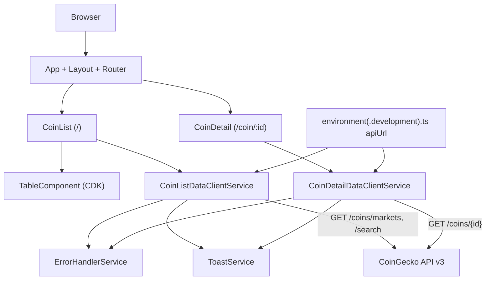

### CoinGecko Client (Angular)

An Angular 20 single‑page app that browses cryptocurrency data from the public CoinGecko v3 API. It shows a paged market list with search and per‑coin detail, using standalone components, Angular Signals, and CDK Table.

### Tech stack

- **Angular**: 20 (standalone components, signals)
- **RxJS**: 7
- **Angular CDK Table** for rendering lists
- **Tailwind CSS** 4 + **daisyUI** (via PostCSS)

### Features

- **Coin list**: Top 25 by market cap (USD), sortable server‑side by market cap desc
- **Search**: Instant search by name/symbol using CoinGecko `/search`
- **Coin detail**: Route `/coin/:id` displays detailed stats
- **Toasts**: Success/error notifications on data operations
- **Error handling**: Centralized `ErrorHandlerService`

### Video tutorial

Watch a complete walkthrough of the application features and setup:

[](https://www.loom.com/share/c0e29724b3f94f3a843289f12f8fe7d8)

### Getting started

1. Install prerequisites
   - Node.js 18+ (20 LTS recommended)
   - npm 9+
2. Install dependencies

```bash
npm install
```

3. Start the dev server

```bash
npm start
# or
ng serve
```

Open `http://localhost:4200/`. The app reloads on file changes.

### Available scripts

```bash
npm start       # ng serve (development)
npm run build   # production build to dist/
npm test        # unit tests (Karma)
```

### Project structure (high level)

- `src/app/features/coin-list/`
  - `coin-list.ts` UI for the market table and search
  - `coin-list-data-client.service.ts` calls `/coins/markets` and `/search`
- `src/app/features/coin-detail/`
  - `coin-detail.ts` loads coin detail by id
  - `coin-detail-data-client.service.ts` calls `/coins/{id}`
- `src/app/shared/components/table.component.ts` reusable CDK table
- `src/app/shared/services/` toast and error‑handler services
- `src/environments/` environment files (API base URL)

### Architecture diagram



### Routing

- `/` → `CoinList`
- `/coin/:id` → `CoinDetail`

### API usage

Base URL is configured in environments as `apiUrl: https://api.coingecko.com/api/v3`.

- List: `GET /coins/markets?vs_currency=usd&order=market_cap_desc&per_page=25&page=1`
- Search: `GET /search?query={q}`
- Detail: `GET /coins/{id}`

CoinGecko public API has rate limits; heavy usage may be throttled.

### Environments

- `src/environments/environment.development.ts` (dev)
- `src/environments/environment.ts` (prod)

Angular CLI replaces files for dev builds per `angular.json`.

### Styling

Tailwind CSS v4 and daisyUI are configured via PostCSS. Global styles in `src/styles.css`.

### Build

```bash
npm run build
```

Artifacts are output to `dist/` with production optimizations enabled.

### Testing

```bash
npm test
```

Runs unit tests with Karma/Jasmine. No e2e configuration is included by default.

### Notes

- This project uses Angular standalone components (no NgModules).
- Signals are used for local reactive state in components/services.

### References

- Angular CLI docs: [angular.dev/tools/cli](https://angular.dev/tools/cli)
- CoinGecko API: [coingecko.com/api/documentation](https://www.coingecko.com/api/documentations/v3)
